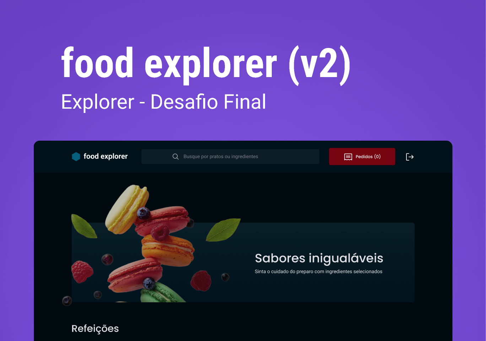

<h1 align="center"> Food Express API </h1>

<h2 align="center"> About </h2>

  The Food Express API is the final project of the Rocketseat Explorer course. 
  The API aims to manage the requests from the web frontend with our database. 

 
<h2 align="center">  </h2>

 

<h2 align="center"> Technologies </h2>

  <a href="#-controllers">Controllers</a>&nbsp;&nbsp;&nbsp;|&nbsp;&nbsp;&nbsp;
  <a href="#-technologies">Technologies</a>&nbsp;&nbsp;&nbsp;|&nbsp;&nbsp;&nbsp;
  <a href="#-libraries">Libraries</a>&nbsp;&nbsp;&nbsp;

## 🎮 Controllers and functionalities

## 🚀 Technologies

This project was developed using the following technologies:

- JavaScript
- Node.js
- Sqlite3
- Git e Github
- Figma
- JWT
- Cookies

  
## 📚 Libraries

This project was developed using the following libraries:

- knex
- express & express-async-errors
- multer
- pm2
- cors
- dotenv
- coookie-parser
- bcryptjs
