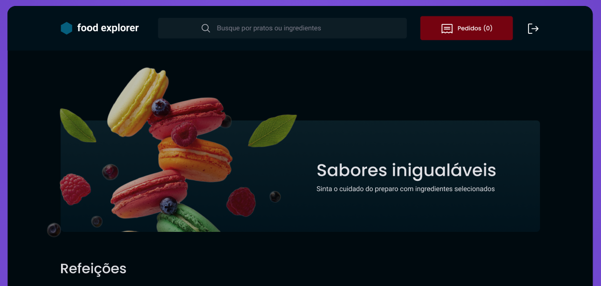

<h1 align="center"> Food Express API 🍽️</h1>

  <a href="#-controllers">Controllers</a>&nbsp;&nbsp;&nbsp;|&nbsp;&nbsp;&nbsp;
  <a href="#-technologies">Technologies</a>&nbsp;&nbsp;&nbsp;|&nbsp;&nbsp;&nbsp;
  <a href="#-libraries">Libraries</a>&nbsp;&nbsp;&nbsp;|&nbsp;&nbsp;&nbsp;
  <a href="#-libraries">Deploy</a>&nbsp;&nbsp;&nbsp;

<h2 align="center"> About </h2>

  The Food Express API is the final project of the Rocketseat Explorer course. 
  The API aims to manage the requests from the web frontend with our database. 

<h2 align="center"> 🎮 Controllers and functionalities </h2>

### Categories:
- **GET /index:** Show all dishes with categories.
- **GET /show:** Show all categories of a specific dish.
- **PUT /update:** Update the categories of a specific dish.

### Dishes:
- **POST /create:** Create a dish and its categories and ingredients.
- **GET /show:** Show all information of a specific dish.
- **GET /index:** Show all dishes in the database.
- **DELETE /delete:** Delete a specific dish.
- **PUT /update:** Update all information of a specific dish, besides dishe image.

### DishesImage
- **POST /create:** Create the favorite category for a specific user and dish.
- **GET /show:** Show the first favorite dish for a user.
- **GET /index:** Show all favorited dishes of a user.
- **PUT /update:** Update favorite information of a specific dish for a specific user.

### HistoricOrders
- **POST /create:** Create the historic user purchases with a unique code.
- **GET /index:** If user role is "customer", show all favorited dishes for that user. If user role is "admin", show all historic orders in the database.
- **PUT /update:** Update a specific historic purchase status

### Ingredients:
- **GET /show:** Show all dishes containing the specific ingredient.

### LastBuyHistoric:
- **GET /show:** Show the last purchase for the specific user.

### Sessions:
- **POST /create:** Create user cookie.

### HistoricOrders
- **POST /create:** create user.

### UsersValidated
- **GET /index:** validated if user has register.

## 🚀 Technologies

This project was developed using the following technologies:

- JavaScript
- Node.js
- Sqlite3
- Git e Github
- Figma
- JWT
- Cookies

  
## 📚 Libraries

This project was developed using the following libraries:

- knex
- express & express-async-errors
- multer
- pm2
- cors
- dotenv
- coookie-parser
- bcryptjs

## ☁️ Deploy
[Dashboard do Render](https://dashboard.render.com/web/srv-cphhs1m3e1ms73d8pgc0/logs?t=app)
[Food Explorer API](https://food-explorer-api-1-7b81.onrender.com)

